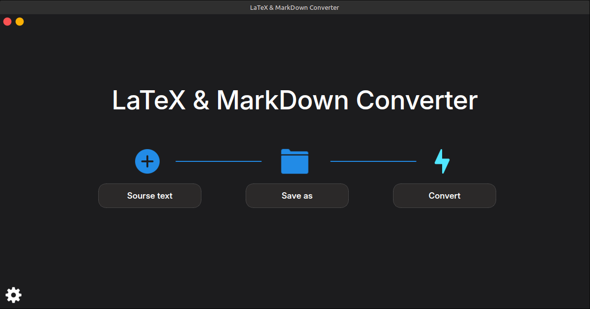
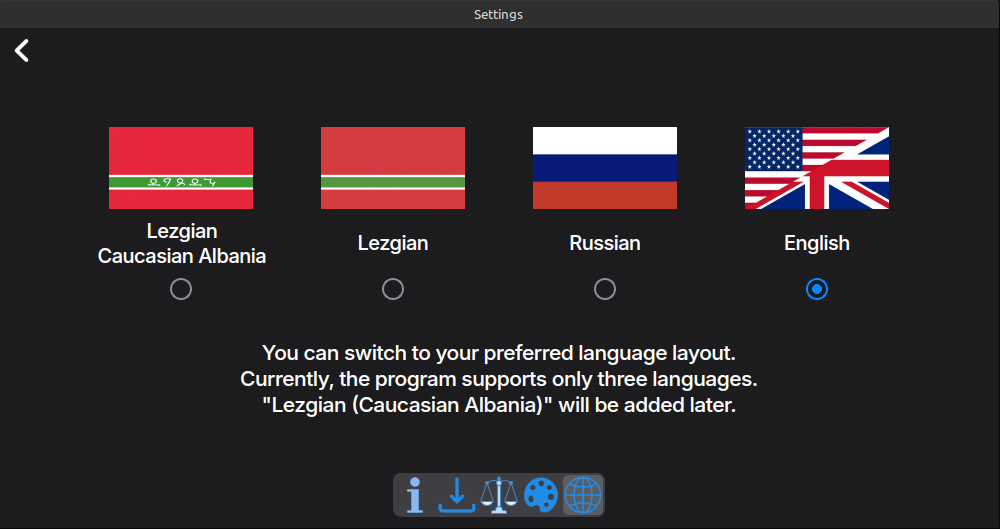

# LaTeX & MarkDown Converter

**LaTeX & MarkDown Converter** — это десктопное приложение, предназначенное для быстрого и удобного преобразования документов из форматов LaTeX и MarkDown в формат PDF. Программа предоставляет простой графический интерфейс для конвертации научных и технических текстов. В основе работы приложения лежит мощный инструмент [pandoc](https://github.com/ueberdosis/pandoc/blob/main/README.md), обеспечивающее высокое качество преобразования.

## 🚀 Как это работает
Интерфейс программы состоит из трех основных шагов:

1.  **Source text (Исходный текст)** — ввод исходного Markdown или LaTeX текста.
2.  **Save as (Сохранить как)** — выбор места и имени для будущего PDF-файла.
3.  **Convert (Конвертировать)** — запуск процесса преобразования.

---

Программа поддерживает Лезгинский, Русский и Английский языки и имеет простой и интуитивно понятный интерфейс.

>Примечание: Лезгинский язык с символами Кавказской Албании будет добавлен в более поздних версиях.